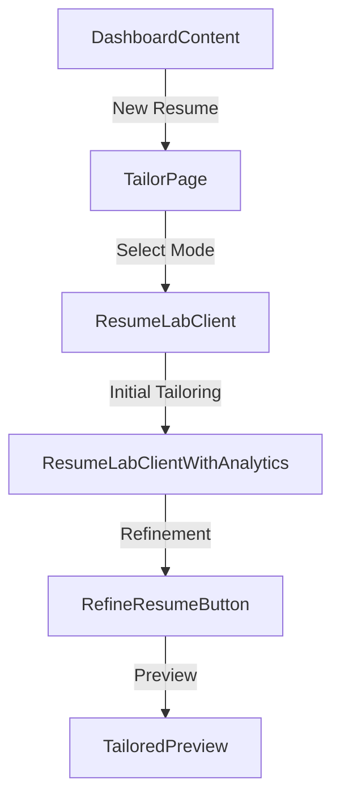
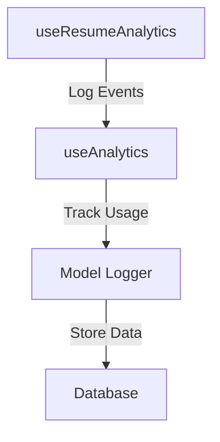

# Lucerna AI Component Documentation

## Core Components

### 1. Dashboard Components

#### DashboardContent
```typescript
// Location: app/dashboard/dashboard-content.tsx
// Purpose: Main dashboard interface
// Features:
- Displays resume history
- New resume creation
- Tailoring settings access
// Analytics:
- Logs dashboard view
- Tracks resume creation attempts
- Monitors settings access
```

#### ResumeHistory
```typescript
// Location: app/dashboard/history/components/HistoryContent.tsx
// Purpose: Displays user's resume history
// Features:
- Groups resumes by date
- Shows tailoring mode and scores
- Provides quick access to resumes
// Analytics:
- Logs resume views
- Tracks history interactions
```

### 2. Resume Editor Components

#### ResumeLabClient
```typescript
// Location: app/dashboard/resume/[id]/components/resume-lab-client.tsx
// Purpose: Main resume editing interface
// Features:
- Original vs tailored view
- Tailoring controls
- Version management
// Analytics:
- Logs editing sessions
- Tracks tailoring attempts
- Monitors version changes
```

#### ResumeLabClientWithAnalytics
```typescript
// Location: app/dashboard/resume/[id]/components/resume-lab-client-with-analytics.tsx
// Purpose: Enhanced resume editor with analytics
// Features:
- All ResumeLabClient features
- Enhanced analytics tracking
- Error boundary integration
// Analytics:
- Detailed interaction logging
- Performance monitoring
- Error tracking
```

### 3. Tailoring Components

#### TailorPage
```typescript
// Location: app/dashboard/tailor/page.tsx
// Purpose: Tailoring mode selection
// Features:
- Mode selection interface
- Mode descriptions
- Premium feature indicators
// Analytics:
- Logs mode selections
- Tracks premium feature views
```

#### RefineResumeButton
```typescript
// Location: app/dashboard/resume/[id]/components/refine-resume-button.tsx
// Purpose: Resume refinement controls
// Features:
- Refinement triggers
- Progress indicators
- Error handling
// Analytics:
- Logs refinement attempts
- Tracks refinement success
- Monitors error rates
```

### 4. Preview Components

#### TailoredPreview
```typescript
// Location: app/dashboard/resume/[id]/components/tailored-preview.tsx
// Purpose: Resume preview and export
// Features:
- Resume preview
- Export options (copy/download/print)
- Score display
// Analytics:
- Logs preview views
- Tracks export actions
- Monitors score views
```

## Analytics Components

### 1. Hooks

#### useResumeAnalytics
```typescript
// Location: hooks/useResumeAnalytics.ts
// Purpose: Analytics operations hook
// Features:
- Resume event logging
- Usage tracking
- Error handling
// Usage:
const { saveResume, runTailoringAnalysis } = useResumeAnalytics()
```

#### useAnalytics
```typescript
// Location: hooks/useAnalytics.ts
// Purpose: General analytics hook
// Features:
- Event logging
- Interaction tracking
- Performance monitoring
// Usage:
const { logEvent, logInteraction } = useAnalytics()
```

### 2. Error Handling

#### ErrorBoundary
```typescript
// Location: components/ErrorBoundary.tsx
// Purpose: Error boundary component
// Features:
- Error catching
- Fallback UI
- Error logging
// Usage:
<ErrorBoundary>
  <YourComponent />
</ErrorBoundary>
```

## Component Interactions

### 1. Resume Creation Flow


### 2. Analytics Flow


## Best Practices

1. **Component Structure**
   - Keep components focused and single-purpose
   - Use composition over inheritance
   - Implement proper error boundaries

2. **State Management**
   - Use React hooks for local state
   - Implement proper loading states
   - Handle errors gracefully

3. **Analytics Integration**
   - Log all user interactions
   - Track performance metrics
   - Monitor error rates

4. **Performance**
   - Implement proper memoization
   - Use lazy loading where appropriate
   - Optimize re-renders

## Future Improvements

1. **Component Enhancements**
   - Add more customization options
   - Improve error handling
   - Enhance performance monitoring

2. **Analytics Improvements**
   - Add more detailed tracking
   - Implement A/B testing
   - Enhance performance metrics

3. **User Experience**
   - Add more feedback mechanisms
   - Improve loading states
   - Enhance error messages 